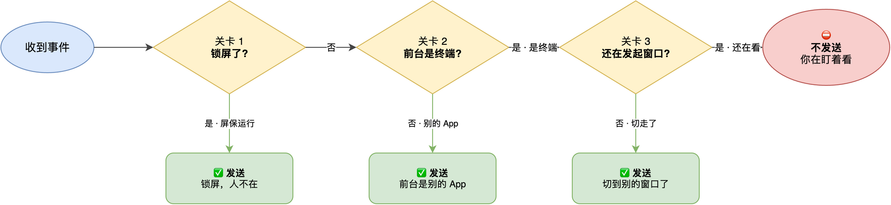
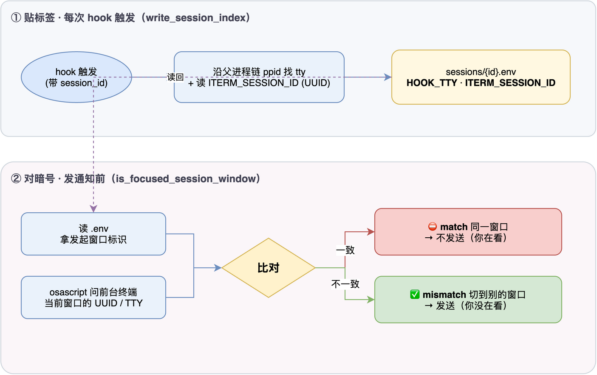
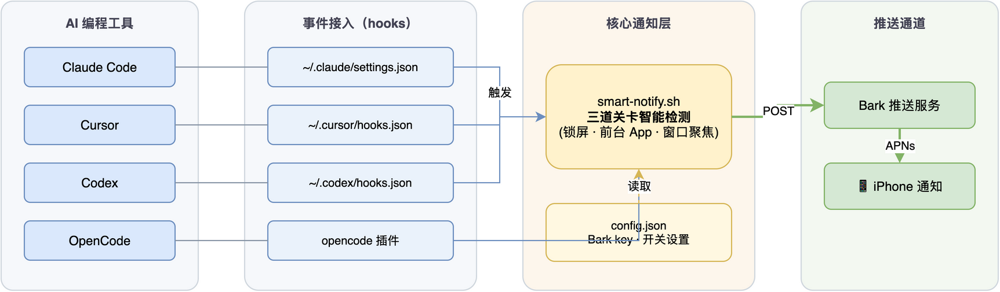

# cc-notify

> AI 写代码时，一旦需要你介入，立刻通知你。**你正盯着屏幕时安静，你离开时才响。**

[](https://www.apple.com/macos)
[](https://github.com/Finb/Bark)
[](LICENSE)

cc-notify 把 Claude Code / Cursor / Codex / OpenCode 的关键事件（需要授权、等你输入、任务完成、会话结束等）通过 [Bark](https://github.com/Finb/Bark) 推到你的手机。它最大的特点不是"能推送"，而是**知道什么时候不该打扰你**。

---

## 为什么需要它

AI Coding 里模型经常需要你**当场介入**：执行命令等你点允许、问 A 还是 B、要你补信息或登录、真正卡住或结束。如果你在查文档、开会或锁屏，AI 在那边空等，你也白白浪费时间——cc-notify 让你在这些时刻被立刻叫回来。

---

## 它怎么决定要不要打扰你

每条通知在发出去之前，会过**三道关卡**，从粗到细地判断你人是不是在、是不是在盯着发起任务那个窗口。任何一道判定"该发"就直接发，不再往下查。



### 三道关卡（由粗到细）

| 关卡 | 判断什么 | 怎么判断 | 该发就发 |
|---|---|---|---|
| **关卡 1 · 锁屏** | 屏幕锁了没 | 查 `ScreenSaverEngine` 进程是否运行 | 锁屏 → 人不在 → 发 |
| **关卡 2 · 前台 App** | 当前最前台是不是终端 | 问 System Events，按路径 / BundleID / 进程名三重匹配终端类 App | 前台是别的 App → 没在看终端 → 发 |
| **关卡 3 · 窗口聚焦** | 前台终端是不是发起任务那个窗口 | 对暗号：会话开始时贴的"窗口身份证" vs 当前前台窗口标识 | 不是同一个窗口（切走了）→ 发 |

三道关卡全过（没锁屏 + 前台是终端 + 还是那个窗口）= 你正盯着，**不打扰**。

> 设计原则：**拿不准就发**。漏掉一条"该回来处理"的通知，比多收一条推送代价大。所以锁屏检测失败、辅助功能没授权、窗口身份证查不到等情况，一律倾向发。

### 关卡 3 的核心：给窗口发身份证

这是 cc-notify 最精巧的地方——只判断"前台是不是终端"不够，你可能开了好几个终端窗口，跑 AI 的是 A，你现在看的是 B。cc-notify 靠**贴标签 + 对暗号**把判断精确到了窗口级：



- **贴标签（每次 hook 触发）**：把"这个会话是在哪个终端窗口里跑的"写进 `~/.cc-notify/sessions/<会话ID>.env`。两个标识：沿父进程链 `ppid` 找到的终端 **TTY**，以及环境变量 `ITERM_SESSION_ID` 里的 **UUID**。会话结束（SessionEnd）时删掉这张标签。
- **对暗号（发通知前）**：读回这张标签拿到"发起窗口"的标识，再用 AppleScript 问当前前台终端"你亮着的窗口标识是什么"，两者一比。iTerm 先比 UUID（最准）、没有再比 TTY 兜底；系统 Terminal 只比 TTY。对上 = `match`（你在看，不发）；对不上 = `mismatch`（切走了，发）。

### 高优先级通知会"等一下再查"

像需要授权、等你回复这种 **high** 级通知，怕你只是瞄一眼就走：会先 `sleep` 几秒（`CC_NOTIFY_RECHECK_SECONDS`，默认 5），再把关卡 1 和 3 重查一遍。几秒后你还在那个窗口 → 算了不发（你确实在处理）；你走了或锁屏了 → 发。`low` 级（如会话结束）一次定，不重检。

---

## 系统架构



各 AI 工具的 hook 配置指向同一个 `smart-notify.sh`，它读完事件上下文、做完上面的智能检测，再通过 Bark 推送到 iOS。

---

## 支持的工具

| 工具 | 状态 | 默认通知策略 |
|---|---|---|
| Claude Code | ✅ | 精确监听权限确认、等待输入、Elicitation、真正终止失败 |
| Cursor | ✅ | 轻量支持，默认只监听 `stop`，避免 Shell 过程噪音 |
| OpenCode | ✅ | 使用官方插件机制监听 `permission.asked` / `session.error` / `session.idle` |
| Codex | ✅ | 使用官方实验 hooks；对 `Stop` 做"是否在等你回复"的启发式识别，并监听 Bash 后的人工可处理错误 |
| 其他工具 | ✅ | 可通过统一 CLI 参数接入 |

---

## 快速开始

### 1. 前置要求

- macOS（锁屏检测、前台应用检测依赖 macOS）
- [Bark App](https://apps.apple.com/app/bark/id1403753865)（iOS 通知推送）
- jq：`brew install jq`

### 2. 安装

```bash
# 方式一：curl 一键安装（推荐，发布后把 USER/cc-notify 换成你的仓库地址）
curl -fsSL https://raw.githubusercontent.com/USER/cc-notify/main/install.sh | bash

# 方式二：本地安装
git clone https://github.com/USER/cc-notify.git
cd cc-notify
./install.sh
```

安装脚本会自动检测已安装的 AI 工具，提供交互式多选界面（装了 `fzf` 或 `gum` 体验更好）。

### 3. 配置 Bark

1. iPhone 上安装 [Bark](https://apps.apple.com/app/bark/id1403753865)，复制你的 Key
2. 安装时按提示输入，或预先 `export BARK_KEY=你的BarkKey`

### 4. 授权辅助功能

首次使用需在 **系统设置 → 隐私与安全 → 辅助功能** 中授权终端应用——关卡 2、3 靠它判断前台是哪个 App / 窗口。没授权会降级为"拿不准就发"。

---

## 通知优先级

| 优先级 | 触发场景 | 行为 |
|---|---|---|
| **高** | 权限确认、等待输入、Elicitation、明确需要人工处理的错误 | 短延迟后重检，确认你已离开再发 |
| **中** | 任务完成、真正停止失败 | 锁屏或切走时发送 |
| **低** | 会话结束、工具停止 | 仅在你离开时发送 |

---

## 默认监听哪些事件

**Claude Code**（默认模板不再把 `Stop` 当任务完成，也不再对所有 `PostToolUseFailure` 报警）：

- `PermissionRequest` · 需要你授权继续
- `Notification(idle_prompt)` · Claude 正在等你补充输入
- `Elicitation` · 等你填表单、登录或提供结构化信息
- `StopFailure` · Claude 真正无法继续
- `TaskCompleted` · 任务完成（主要用于 task/team 工作流）
- `SessionEnd` · 会话结束

**Codex**（官方 hooks 仍是实验能力，事件面较窄，属 best-effort）：`PostToolUse(Bash)` 只在明显需要人工处理的 Bash 错误时提醒；`Stop` 若 `last_assistant_message` 像在等你回复则按高优先级提醒，否则当低优先级"本轮结束"。

**OpenCode**（官方插件机制）：`permission.asked` / `session.error` / `session.idle`。

> 注：当前版本**只对终端窗口做抑制**，前台是编辑器（Cursor / VSCode 等）一律按"没在看终端 → 发"处理。

---

## 配置文件

| 文件 | 路径 | 合并策略 |
|---|---|---|
| 用户配置 | `~/.cc-notify/config.json` | 保留现有配置 |
| 通知脚本 | `~/.cc-notify/bin/smart-notify.sh` | 覆盖更新 |
| 会话索引 | `~/.cc-notify/sessions/*.env` | 运行时自动写入 / 清理 |
| Claude Code | `~/.claude/settings.json` | 升级 cc-notify 管理的 hooks，保留用户自定义 |
| Cursor | `~/.cursor/hooks.json` | 同上 |
| Codex hooks | `~/.codex/hooks.json` | 同上 |
| Codex feature | `~/.codex/config.toml` | 自动启用 `codex_hooks = true` |
| OpenCode 插件 | `~/.config/opencode/plugins/cc-notify.js` | 覆盖更新 |

安装时会自动备份原配置（`.bak.时间戳`），并清理旧版 cc-notify 残留的 hook。

### 几个常用开关（环境变量）

| 变量 | 作用 | 默认 |
|---|---|---|
| `CC_NOTIFY_FORCE_NOTIFY=1` | 跳过所有关卡，强制发送 | 关 |
| `CC_NOTIFY_WINDOW_FOCUS=0` | 关掉关卡 3（窗口级聚焦），退回只看 App | 开 |
| `CC_NOTIFY_RECHECK_SECONDS` | high 通知重检前等待秒数 | 5 |
| `CC_NOTIFY_DEBUG=1` | 打印详细判断日志 | 关 |
| `CC_NOTIFY_DRY_RUN=1` | 干跑，不真的调 Bark | 关 |

---

## 测试与调试

```bash
# 三种优先级各来一条
~/.cc-notify/bin/smart-notify.sh "测试" "安装成功" "normal"
~/.cc-notify/bin/smart-notify.sh "测试" "需要确认" "high"
~/.cc-notify/bin/smart-notify.sh "测试" "低优先级" "low"

# 干跑 + 强制发送，方便调试事件分类（不真的推送）
printf '%s' '{"hook_event_name":"Notification","notification_type":"idle_prompt","message":"请补充部署环境"}' \
  | CC_NOTIFY_DRY_RUN=1 CC_NOTIFY_FORCE_NOTIFY=1 \
    ~/.cc-notify/bin/smart-notify.sh --source claude-code

# 开详细日志，看三道关卡各自怎么判的
CC_NOTIFY_DEBUG=1 ~/.cc-notify/bin/smart-notify.sh "测试" "调试" "normal"
```

调试输出示例（前台是终端且窗口匹配 → 不发）：

```
[DEBUG] 锁屏状态: 0
[DEBUG] 应用信息: [iTerm2    /Applications/iTerm.app    com.googlecode.iterm2]
[DEBUG] 匹配终端应用（Bundle ID）: com.googlecode.iterm2
[DEBUG] 前台窗口标识: [uuid...    ttyp1]
[DEBUG] iTerm2 UUID 匹配: ...
[DEBUG] 用户在关注中，不发送通知
```

---

## 故障排查

**没收到通知**：确认 Bark Key 正确 → 手动测 `curl "https://api.day.app/YOUR_KEY/测试/内容"` → 确认辅助功能已授权。

**一直在发通知（刷屏）**：通常是辅助功能没授权，关卡 2/3 拿不到前台信息，降级成"无脑发"。授权后用 `osascript -e 'tell application "System Events" to get name of first application process whose frontmost is true'` 确认能拿到前台 App。

**从不发通知**：检查 `~/.cc-notify/config.json` 里的 Bark Key 和网络。

**SessionEnd 偶尔报 `cancelled`**：Claude Code 的 SessionEnd hook 默认只有 1.5s 超时预算，而发推送的 `curl` 走系统代理会变慢，叠加 osascript 检测可能超时。发推送的 curl 已加 `--noproxy '*'` 直连 Bark；若仍偶发，可把 SessionEnd 的 hook 命令改成 `nohup ... &` 后台化。

---

## 扩展到其他工具

通知脚本支持统一 CLI 入口，接入新工具只需把事件映射成参数：

```bash
~/.cc-notify/bin/smart-notify.sh \
  --source my-tool \
  --event approval_required \
  --kind intervention \
  --title "⚠️ 需要确认" \
  --body "my-tool 正在等待你的确认" \
  --priority high
```

---

## 目录结构

```
cc-notify/
├── install.sh                  # 一键安装入口
├── lib/
│   ├── common.sh               # 公共函数
│   ├── detect.sh               # 工具检测
│   ├── configure.sh            # 配置合并
│   └── notify.sh               # 核心通知脚本（含三道关卡智能检测）
├── templates/                  # 各工具的 hook 模板
├── smart-detect-flow.drawio    # 决策流程图源（可编辑）
├── window-focus.drawio         # 窗口聚焦机制图源（可编辑）
├── cc-notify-arch.drawio       # 系统架构图源（可编辑）
├── CHANGELOG.md
└── README.md
```

---

## 参考

- [Bark](https://github.com/Finb/Bark) · iOS 通知推送
- [Claude Code Hooks](https://docs.anthropic.com/claude-code/hooks)
- [Cursor Hooks (beta)](https://cursor.com/changelog/1-7/)
- [OpenAI Codex Hooks](https://developers.openai.com/codex/hooks)
- [OpenCode Plugins](https://opencode.ai/docs/plugins/)

## Changelog

详见 [CHANGELOG.md](CHANGELOG.md)

## License

MIT
